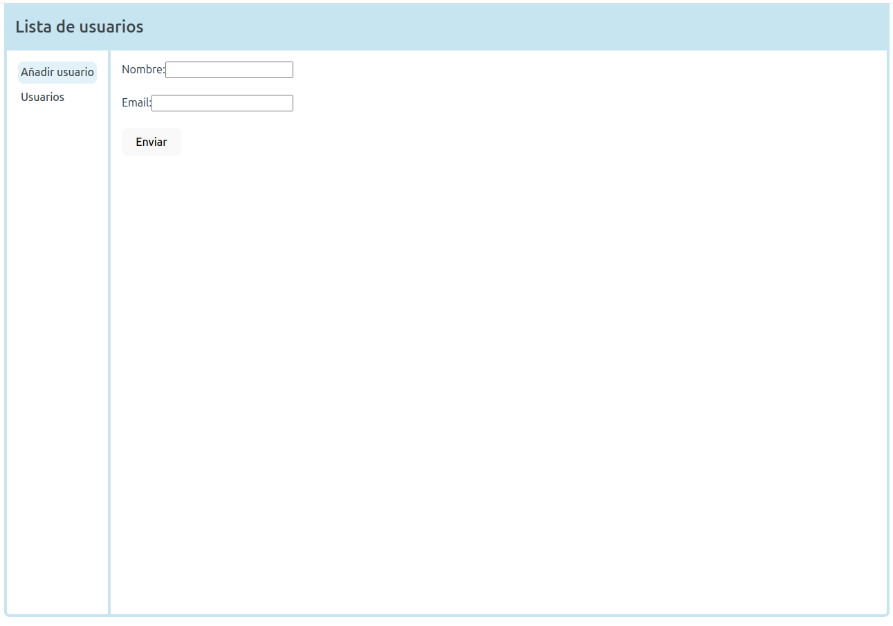
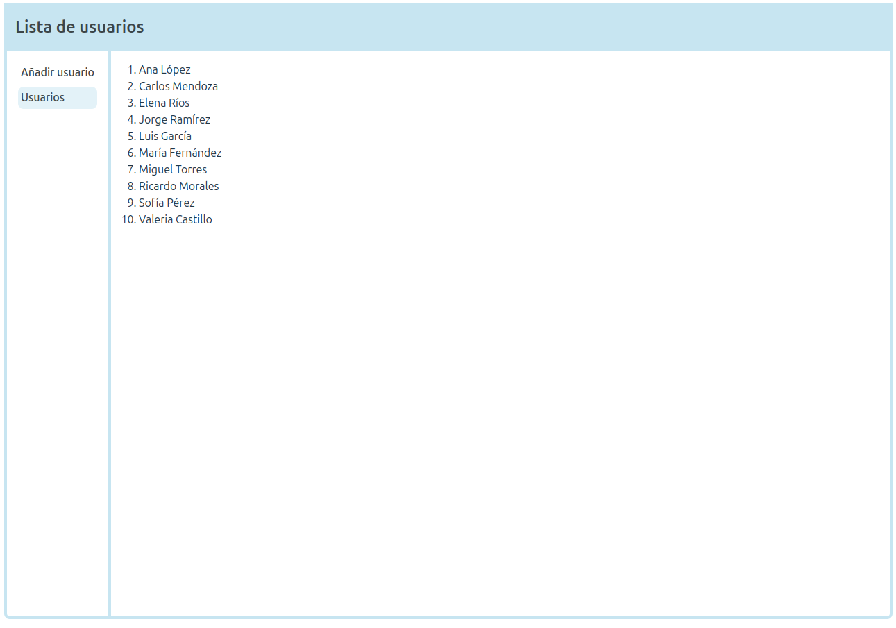

# Dynamicore React Test

## Table of contents

- [Overview](#overview)
  - [The challenge](#the-challenge)
  - [Screenshot](#screenshot)
  - [Links](#links)
- [My process](#my-process)
  - [Built with](#built-with)
- [Install](#install)
- [Author](#author)

## Overview

### The challenge

Create a functional component in React that receives a list of user objects (with name and age) and renders an ordered list of names.
Create a form component in React that allows a user to enter their name and email address, and upon submission, displays the entered data below the form.

### Screenshot

### Links

- Solution URL: [Solution URL](https://github.com/adrianburgoscolas/dynamicore_users)

## My process

### Built with

- [React.js](https://react.dev/) - Frontend library
- [TypeScript1](https://www.typescriptlang.org/) - TypeScript is a strongly typed programming language that builds on JavaScript
- Semantic HTML5 markup

## Install

- Clone repository `git clone git@github.com:adrianburgoscolas/dynamicore_users.git`
- Go to project folder `cd dynamicore_users`
- Install dependencies `npm install`
- Start project `npm run dev`
- The project should be running `http://localhost:5173/`

## Author

- Website - [Adrian Burgos: Portfolio](https://adrianburgoscolas.github.io/portfolio/)
- GitHub - [https://github.com/adrianburgoscolas](https://github.com/adrianburgoscolas)
- LinkedIn - [Adrian Burgos Web Developer](https://www.linkedin.com/in/adrian-burgos-1776a6144/)
